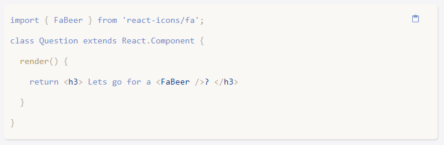

# CodeBlock

if you want to insert example code in your page, this component will help you

## Demo


## installation

first you need to install the following dependencies: <br />
1. cogo-toast <br />
2. copy-to-clipboard<br />
3. prism-react-renderer<br />
4. prop-types<br />
5. react-icons<br />

then clone CodeBlock.jsx

## usage 

```jsx 
<CodeBlock language="bash" code={`insert code here`} />
```
## style
you can change the theme modifing the file CodeBlock.jsx, in the top of the document you will find:
```jsx 
//theme
  import PrismTheme from "prism-react-renderer/themes/nameOfTheme";
```
you can use the following themes
1. dracula
2. duotoneDark
3. duotoneLight
4. github
5. nightOwl
6. nightOwlLight
7. oceanicNext
8. ultramin
9. shadesOfPurple
10. vsDark <br />
also you can style this component with the following classes: <br />
codeBlock__pre<br />
codeBlock__link<br />
codeBlock__icon<br />
but in this case you will be limited by the theme, i.e. you will only be able to modify the properties that the theme does not modify, for example you can change the padding, the margin, etc.

## About
 I have extracted this code from react icons with the intention of facilitating the use of this component, since when i wanted to style 
 ```html
<pre> </pre> and <code> </code>
 ```
  I realized that it was more difficult than expected.

## Themes
### dracula

### duotoneDark

### duotoneLight

### github

### nightOwl

### nightOwlLight

### oceanicNext

### ultramin

### shadesOfPurple

### vsDark

